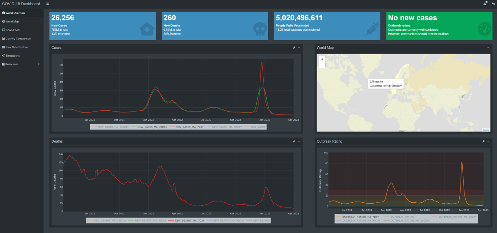

<!-- README.md is generated from README.Rmd. Please edit that file -->

```{r, include = FALSE}
knitr::opts_chunk$set(
  collapse = TRUE,
  comment = "#>"
)
```

# COVID-19 Dashboard

<!-- badges: start -->
[](https://lifecycle.r-lib.org/articles/stages.html#experimental)
<!-- badges: end -->



The purpose of this application is to provide users with an up-to-date view of the worldwide Covid-19 situation. 
It provides useful metrics to assist in decision making for those who reside or intend to visit countries impacted by Covid-19.

## Data
The data used in this dashboard is sourced from the [World Health Organisation (WHO)](https://covid19.who.int/data).

A data pipeline will run daily where it downloads the data to the local repo
and saves and an RDS file, this is to keep any tibble metadata. Given the data
is very small, there is no need to worry about memory, storage, input or output.
If datasets were to grow to a very large size, then the 
[fst package](https://www.fstpackage.org/) would be used for reading and writing
and resulting files will be coerced to tibble (which is a very fast operation 
given the underlying data doesn't change, more meta data is just added.)

Data is saved in the `data/` directory, which is gitignored. Details of source
links and schemas are located in `config/data_source_config.R`. Each data source
has information for `url`, `col_types` and `output_path`.

`scripts/data_pipeline.R` can be used to manually trigger the refresh of the 
data.

## Application
TODO - details about navigating the application

## Deployment
TODO - details about git actions and docker
TODO - testing

## Development

### Project structure
```

├── .devcontainer              <- Devcontainer configuration
├── .vscode                    <- VS Code configuration
├── data                       <- Data storage. (git ignored)
│   ├── input                  <- Save location for data to be ingested by application
│   └── output                 <- Save location for data exported from the application
├── dev                        <- Development scripts, package setup, etc. Code run outside the app
│   ├── prototype              <- Prototypes of shing modules and functions 
│   ├── scripts                <- Scripts used in development of the package
│   └── templates              <- Templates and examples of code snippets
├── docker                     <- Docker configuration
│   └── Dockerfile             <- Docker image configuration
├── inst                       <- Additional files such as images
│   ├── config                 <- Project configurations. R and yaml files.
│   ├── images                 <- jpeg, png and other images 
│   ├── scripts                <- javascript scripts
│   ├── styles                 <- css and styling
│   └── queries                <- Database queries (e.g. SQL)
├── man                        <- Package documentation
├── R                          <- R functions (all should be unit tested)
│   ├── mod-<name>.R           <- Shiny module
│   ├── mod-dashboard-<name>.R <- Dashboard component (header, sidebar, body, etc)
│   ├── page-<name>.R          <- Page in dashboard
│   ├── ui.R                   <- UI function for shiny app
│   └── server.R               <- Server function for shiny app
├── tests                      <- Test related files and scripts
│   ├── testthat               <- R unit testing
│   └── testthat.R             <- Run R unit testing
├── app.R                      <- Shiny application
├── CovidDashboard.Rproj       <- R project file
├── DESCRIPTION                <- Package metadata and dependencies
├── LICENSE                    <- Package license
├── NAMESPACE                  <- Function imports and exports of the package
├── README.md                  <- The top-level README for developers using this project (do not edit)
└── README.rmd                 <- The top-level README for developers using this project (do edit)
```

### Adding features
TODO - pages, components, functions, modules, scripts, tests, queries
TODO - less dependencies the better

### Developing outside of the Shiny framework
TODO

### Conforming to existing codebase
Conforming to the existing style is very important (excluding times where large
refactoring is done). Developers should stick to already used R packages if 
possible. E.g. use `dplyr` rather than `data.table`. (`data.table` is amazing, 
but `dplyr` is used for this product).

All unit tests should use `testthat` style framework..
